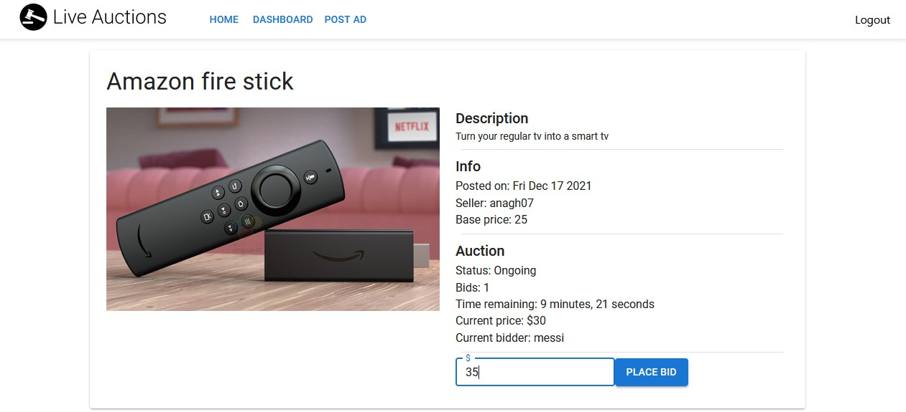

## Language, Frameworks and Libraries
Backed (REST API):
- Node.js
- Express
- Javascript

Frontend (Web application):
- React JS
- Redux (State management)
- Material UI (Theme and ui components)

Database:
- Mongodb

Storage:
- Cloudinary

## Screenshots:

  

 

  

